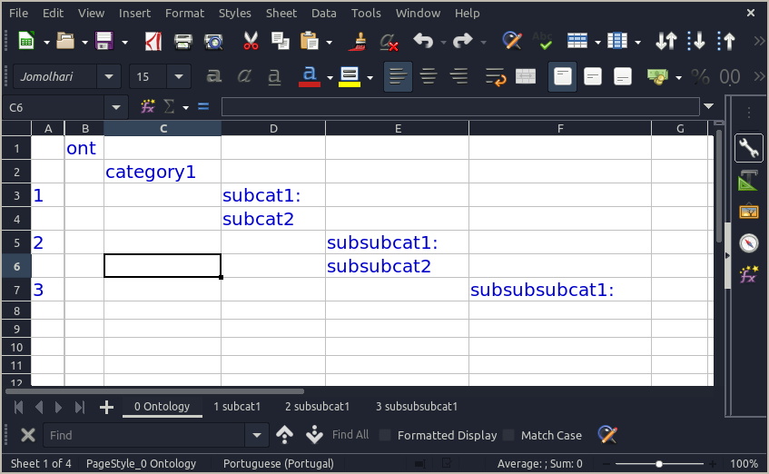
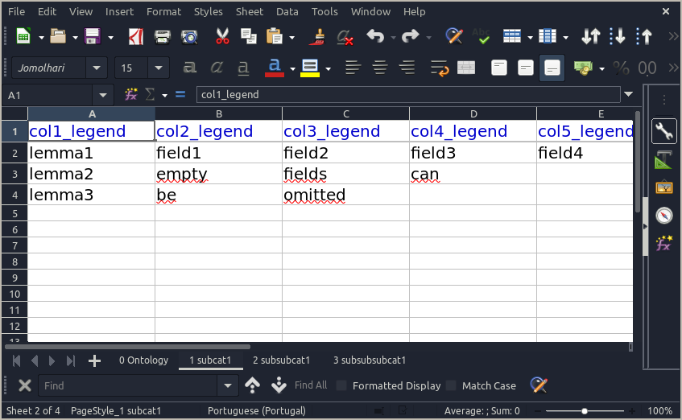
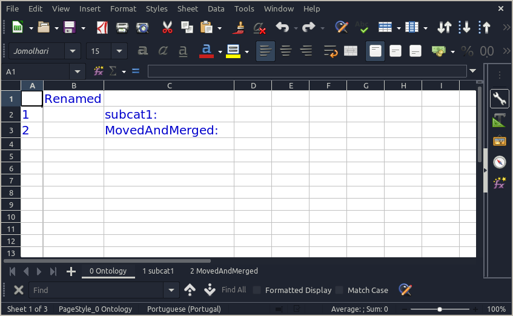

# LeavedOnto
Managing leaved ontologies

## Leaved Ontology
An ontology is a tree-like structure organizing words or ideas. Each entry or word in what we name a "leaved ontology" is a row in a speadsheet, allowing to add as many fields/leaves as a spreadsheet row can handle.

## Usage of OntoManager

```python
from leavedonto import OntoManager

om = OntoManager('master_onto.yaml')

om.diff_ontos('test_onto2.yaml', mode='all')
# mode options: all, base_only, other_only, shared
# default value is "all"
# returns a list of tuple(path, entry) 
# "all" returns three lists, "base_only", "shared" and "other_only"

om.merge_to_onto('test_onto2', in_to_organize=True)
# merges entries from test_onto2.yaml that are not in master_onto.yaml
# if in_to_organize == True, new entries are in a "to_organize" branch, 
# otherwise, they are integrated in master_onto.yaml
```

## Usage of LeavedOnto
### 1. Create the initial `.yaml` ontology

```yaml
legend: [col1_legend, col2_legend, col3_legend, col4_legend, col5_legend]
ont:
  category1:
    subcat1:
    - [lemma1, field1, field2, field3, field4]
    - [lemma2, empty,  fields, can]
    - [lemma3, be,     omitted]
    subcat2:
      subsubcat1:
      - [lemma]
      - [only]
      subsubcat2:
        subsubsubcat1:
        - [nest]
        - [as much as]
        - [needed]
```
notes: 
- `legend` and `ont` are keywords that can't be changed.
- levels in the tree must either contain a list of entries, or nested levels, not both.
- entries in a given branch must all have distinct lemmas. Duplicates will be deleted at conversion.
- entries are sorted according to the Tibetan sorting order (or latin).

### 2. Convert to a `.xlsx` spreadsheet
```python
from leavedonto import LeavedOnto

lo = LeavedOnto('master_onto.yaml')
lo.convert2xlsx('output')
# if argument is:
# - nothing: a .xlsx will be created besides master_onto.yaml
# - a directory: if missing, it will be created. a .xlsx will be created in the directory
# - a path to a .xlsx: the xlsx will be written 
```

#### Ontology sheet


`1` in cell `A3` indicates that the entries of `subcat1` are in the sheet starting with `1` 

#### Entries sheet


### 3. Edit entries
Edit entries and/or the data belonging to each entry in the branch sheets.
All the cells in BLUE contain the structure of the ontology. They should only be modified after being converted to `yaml`.

(in this example, added 1 entry in the sheet `1 subcat1`)

### 4. Edit the tree structure
#### a. convert the `.xlsx` file into a `.yaml`
```python
from leavedonto import LeavedOnto

lo = LeavedOnto('output/test_onto.xlsx')
lo.convert2yaml('output')
# if argument is:
# - nothing: a .yaml will be created besides test_onto.xlsx
# - a directory: if missing, it will be created. a .yaml will be created in the directory
# - a path to a .yaml: the yaml will be written
```

Output:

```yaml
legend: [col1_legend, col2_legend, col3_legend, col4_legend, col5_legend]
ont:
  category1:
    subcat1:
    - [lemma1, field1, field2, field3, field4]
    - [lemma2, empty, fields, can, '']
    - [lemma3, be, omitted, '', '']
    - [new lemma, new1, new2, '', '']
    subcat2:
      subsubcat1:
      - [lemma, '', '', '', '']
      - [only, '', '', '', '']
      subsubcat2:
        subsubsubcat1:
        - [as much as, '', '', '', '']
        - [needed, '', '', '', '']
        - [nest, '', '', '', '']
```
note: the added entry `new lemma` is there.

#### b. Update the leaved ontology structure
##### b.1. Update it manually:
```yaml
legend: [col1_legend, col2_legend, col3_legend, col4_legend, col5_legend]
ont:
  Renamed:
    subcat1:
    - [lemma1, field1, field2, field3, field4]
    - [lemma2, empty, fields, can, '']
    - [lemma3, be, omitted, '', '']
    - [new lemma, new1, new2, '', '']
    MovedAndMerged:
    - [as much as, '', '', '', '']
    - [needed, '', '', '', '']
    - [nest, '', '', '', '']
    - [lemma, '', '', '', '']
    - [only, '', '', '', '']
```

##### b.2. export it to `xlsx`

```python
from leavedonto import LeavedOnto

lo = LeavedOnto('output/test_onto_.yaml')
lo.convert2xlsx('output')
```
Output:



### 5. Update the legends
#### Option1: spreadsheet
Modify the legend in the sheet starting with `1 `, then apply it to all the sheets with:

```python
from leavedonto import LeavedOnto

lo = LeavedOnto('output/test_onto.xlsx')
lo.convert2xlsx('output')
```

#### Option2: yaml
Modify the first line of the `yaml` file.
